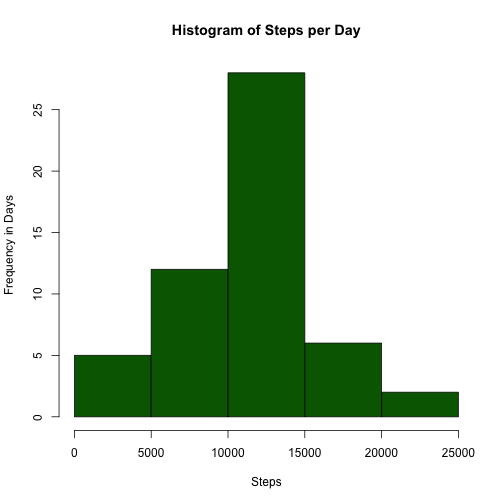
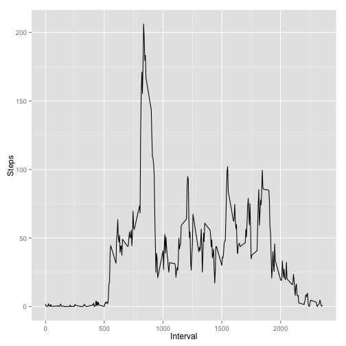
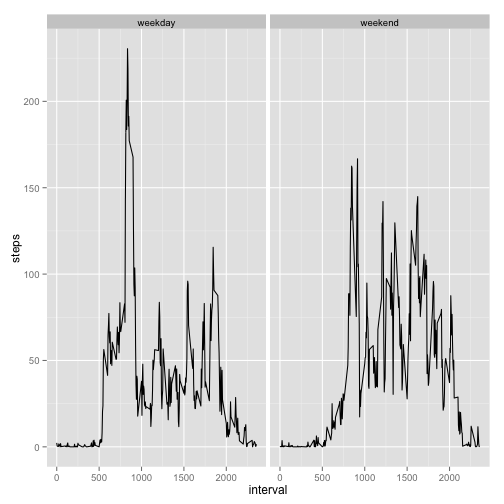

## Loading and preprocessing the data

```r
unzip("activity.zip")
data <- read.csv("activity.csv",header=T,sep=",",na.strings="NA",colClasses=c("integer","Date","integer"))
```


## What is mean total number of steps taken per day?
*Make a histogram of the total number of steps taken each day*

```r
library(scales)
library(ggplot2)
dataNoNa <- data[complete.cases(data),]
stepsByDay <- aggregate(x=dataNoNa$steps,by=list(dataNoNa$date),FUN=sum)
colnames(stepsByDay) <- c("date","steps")
with(stepsByDay, hist(steps,col="darkgreen",main="Histogram of Steps per Day", xlab="Steps", ylab="Frequency in Days"))
```

 

*Calculate and report the mean and median total number of steps taken per day*

```r
mean(stepsByDay$steps)
```

```
## [1] 10766
```

```r
median(stepsByDay$steps)
```

```
## [1] 10765
```


## What is the average daily activity pattern?
*Make a time series plot (i.e. type = "l") of the 5-minute interval (x-axis) and the average number of steps taken, averaged across all days (y-axis)*


```r
avgStepsByInterval <- aggregate(x=dataNoNa$steps,by=list(dataNoNa$interval),FUN=mean)
colnames(avgStepsByInterval) <- c("interval","steps")
with(avgStepsByInterval,qplot(interval,steps,geom="line",xlab="Interval", ylab="Steps"))
```

 
### Which 5-minute interval, on average across all the days in the dataset, contains the maximum number of steps?

```r
tail(avgStepsByInterval[order(avgStepsByInterval$steps),],1)
```

```
##     interval steps
## 104      835 206.2
```

## Imputing missing values
### Calculate and report the total number of missing values in the dataset (i.e. the total number of rows with NAs)

```r
length(which(!complete.cases(data)))
```

```
## [1] 2304
```
### Devise a strategy for filling in all of the missing values in the dataset. The strategy does not need to be sophisticated. For example, you could use the mean/median for that day, or the mean for that 5-minute interval, etc.

**Imputing missing values and creating new data set using the ceiling of the mean of the 5-minute interval across all days.**

```r
dataComplete <- data
for(i in 1:nrow(dataComplete)){
  if(is.na(dataComplete[i,1])){
     intvl <- dataComplete[i,"interval"]
     newStepVal <- ceiling(avgStepsByInterval[avgStepsByInterval$interval == intvl,"steps"])
     dataComplete[i,"steps"] <- newStepVal
  }
}
```

### Make a histogram of the total number of steps taken each day and Calculate and report the mean and median total number of steps taken per day. Do these values differ from the estimates from the first part of the assignment? What is the impact of imputing missing data on the estimates of the total daily number of steps?


```r
stepsByDayComplete <- aggregate(x=dataComplete$steps,by=list(dataComplete$date),FUN=sum)
colnames(stepsByDayComplete) <- c("date","steps")
with(stepsByDay, hist(steps,col="darkgreen",main="Histogram of Steps per Day", xlab="Steps", ylab="Frequency in Days"))
```

 

*Calculate and report the mean and median total number of steps taken per day*
*See Comparison of the results with the original calculation*

```r
data.frame(Original = c(Mean=mean(stepsByDay$steps),
                        Median=median(stepsByDay$steps)), 
            Impuned = c(mean(stepsByDayComplete$steps),
                        median(stepsByDayComplete$steps)))
```

```
##        Original Impuned
## Mean      10766   10785
## Median    10765   10909
```

## Are there differences in activity patterns between weekdays and weekends?
*Create a new factor variable in the dataset with two levels – “weekday” and “weekend” indicating whether a given date is a weekday or weekend day.*

```r
for(i in 1:nrow(dataComplete)){
  if(weekdays(dataComplete[i,"date"]) %in% c("Saturday","Sunday")){
     dataComplete[i,"daytype"] <- "weekend"
  }else{
      dataComplete[i,"daytype"] <- "weekday"
  }
}
dataComplete$daytype <- factor(dataComplete$daytype)
```

*Make a panel plot containing a time series plot (i.e. type = "l") of the 5-minute interval (x-axis) and the average number of steps taken, averaged across all weekday days or weekend days (y-axis).*


```r
avgStepsByIntervalComplete <- aggregate(x=dataComplete$steps,by=list(dataComplete$interval,dataComplete$daytype),FUN=mean)
colnames(avgStepsByIntervalComplete) <- c("interval","daytype","steps")
qplot(interval, steps, data=avgStepsByIntervalComplete,geom="line",facets=. ~ daytype)
```

 
